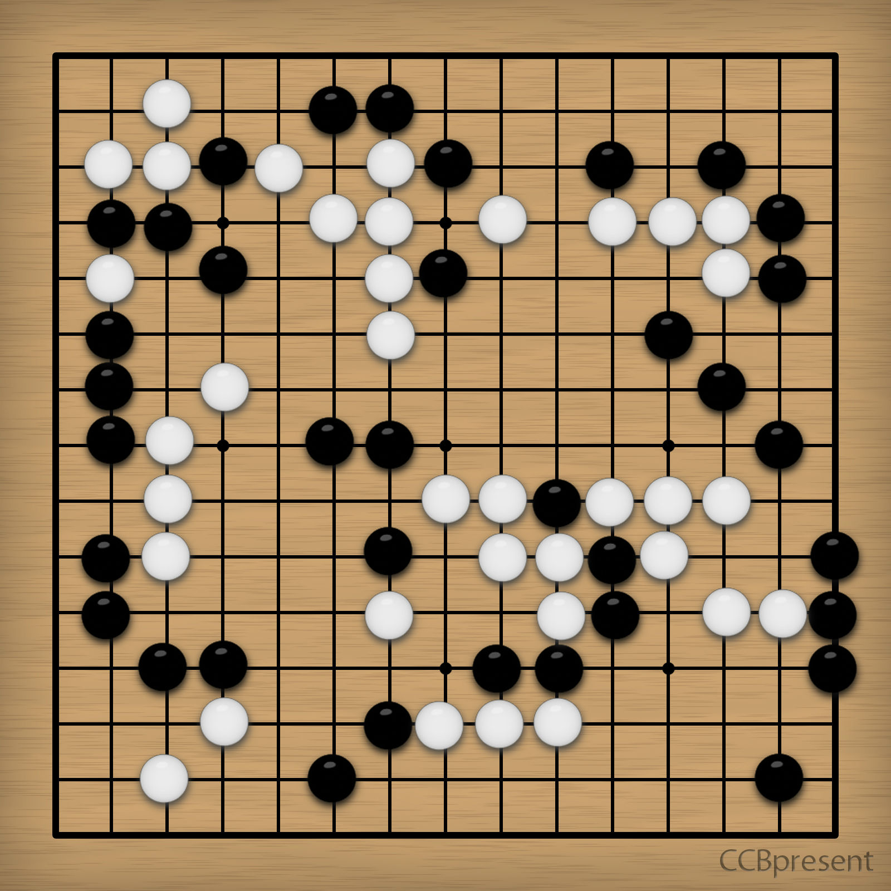

# 第二幕（下）・房间 4

## 题面

“果然还是……棋啊……”
“一样是棋，但是解法却是完全不同的，真是有趣……应该难不倒你吧，老蔡？”

## 答案

_官方存档未提供答案。_

## 解析

_官方存档未填写解析。_

## 本地附件

- [449d7cd987b1928338012f39.jpg](../../../assets/imgsrc.baidu.com/forum/pic/item/449d7cd987b1928338012f39.jpg)

来源：[https://tieba.baidu.com/p/1181018380?see_lz=1](https://tieba.baidu.com/p/1181018380?see_lz=1)
