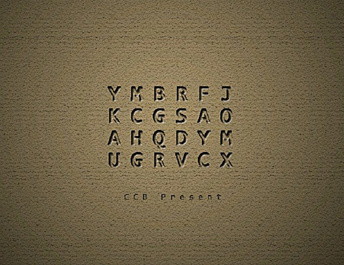

# 第二幕（下）・房间 5

## 题面

“我想下辈子再也不碰和字母沾边的东西了……”
“YMBRFJ……郁闷不让放假……”
“别想了……古代人不会那么脑残的……”

## 答案

_官方存档未提供答案。_

## 解析

_官方存档未填写解析。_

## 本地附件

- [31d9d43fe73a37a87c1e710e.jpg](../../../assets/imgsrc.baidu.com/forum/pic/item/31d9d43fe73a37a87c1e710e.jpg)

来源：[https://tieba.baidu.com/p/1181018380?see_lz=1](https://tieba.baidu.com/p/1181018380?see_lz=1)
