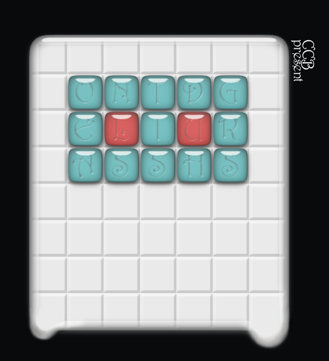

# 第二幕（下）・房间 7

## 题面

“这个图形……怎么看怎么像我之前看过的一个动画片的怪物……”
“这题很有意思啊……”
“你看……这里是眼睛……这里是脚……”
“别再说那些无关紧要的了，专心解题吧……

## 答案

_官方存档未提供答案。_

## 解析

_官方存档未填写解析。_

## 本地附件

- [bebf3d6d902b2191421694e9.jpg](../../../assets/imgsrc.baidu.com/forum/pic/item/bebf3d6d902b2191421694e9.jpg)

来源：[https://tieba.baidu.com/p/1181018380?see_lz=1](https://tieba.baidu.com/p/1181018380?see_lz=1)
