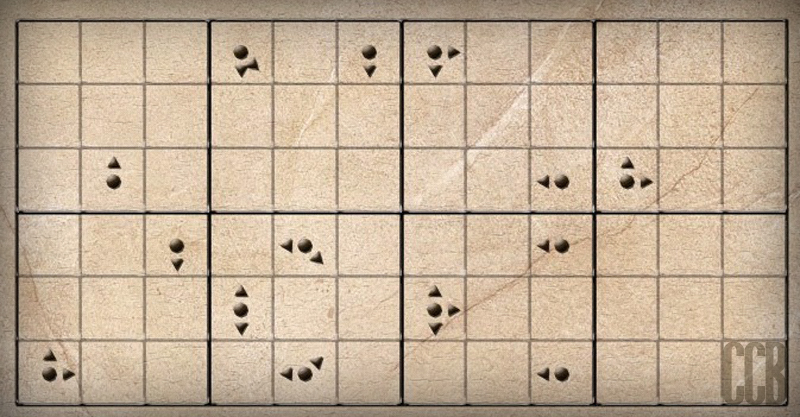

# 第二幕（上）・房间 1

## 题面

“我越来越想知道顶层到底有什么了啊，真是激动人心啊……”
“我想……解开这个谜题就可以通过这个装置打开楼梯锁，上到更上一层了。”蔡巍一边研究着房间里的装置一边说道。

## 答案

_官方存档未提供答案。_

## 解析

_官方存档未填写解析。_

## 本地附件

- [5b6fb1357b4108e2a71e1212.jpg](../../../assets/imgsrc.baidu.com/forum/pic/item/5b6fb1357b4108e2a71e1212.jpg)

来源：[https://tieba.baidu.com/p/1173852788?see_lz=1](https://tieba.baidu.com/p/1173852788?see_lz=1)
