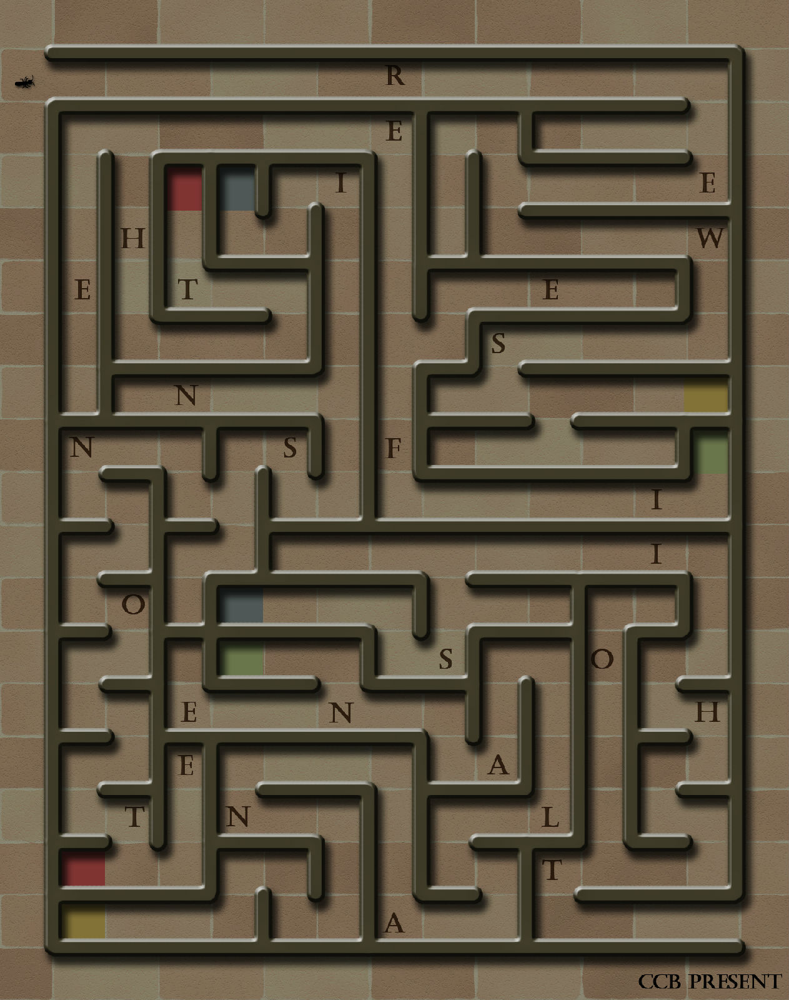

# 第二幕（上）・房间 2

## 题面

“没想到还有迷宫啊……”
“幸好没让咱们真的走迷宫……”蔡巍夹着电筒，开始在笔记本上写写画画的。

## 答案

_官方存档未提供答案。_

## 解析

_官方存档未填写解析。_

## 本地附件

- [2e6c70cf627b1554f9dc6113.jpg](../../../assets/imgsrc.baidu.com/forum/pic/item/2e6c70cf627b1554f9dc6113.jpg)

来源：[https://tieba.baidu.com/p/1173852788?see_lz=1](https://tieba.baidu.com/p/1173852788?see_lz=1)
