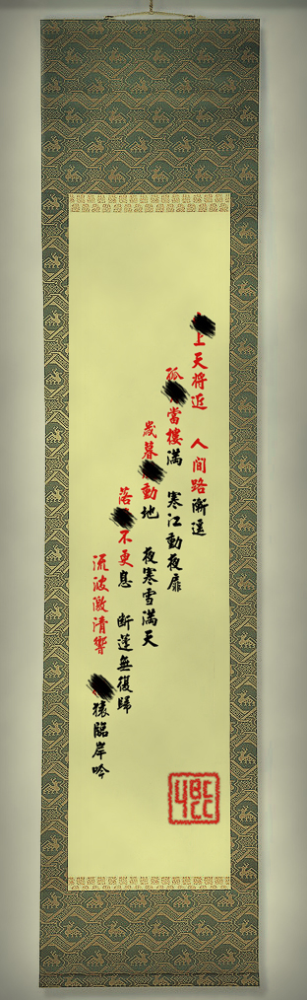

# 第二幕（上）・房间 3

## 题面

“擦……我感到人生观受到了冲击……这一定是外星人的作品……”
“确实……这些诗句……不是那个时代的作品啊……”

## 答案

_官方存档未提供答案。_

## 解析

_官方存档未填写解析。_

## 本地附件

- [019c7b89e0ed85da0e244413.jpg](../../../assets/imgsrc.baidu.com/forum/pic/item/019c7b89e0ed85da0e244413.jpg)

来源：[https://tieba.baidu.com/p/1173852788?see_lz=1](https://tieba.baidu.com/p/1173852788?see_lz=1)
