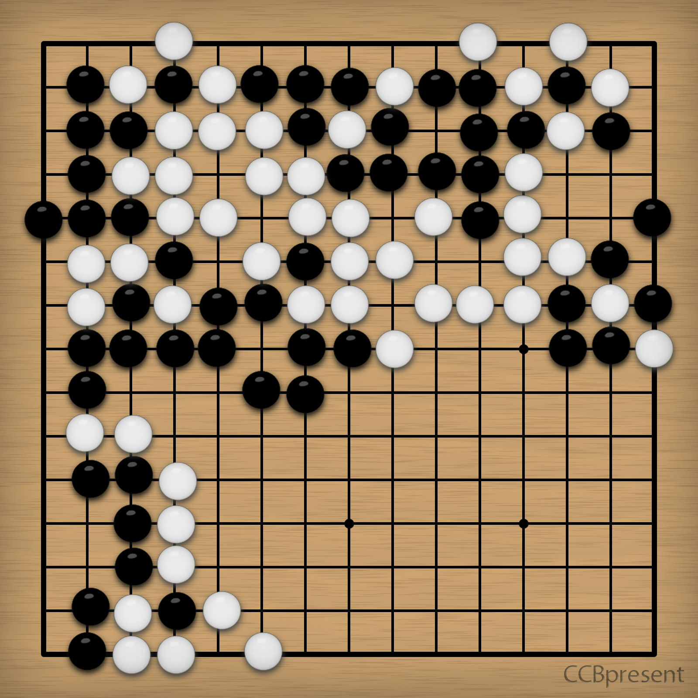

# 第二幕（上）・房间 4

## 题面

“呃……这是要我们下棋么……”
“果然……棋子是固定住的，解开这个就可以继续前进了吧。”

## 答案

_官方存档未提供答案。_

## 解析

_官方存档未填写解析。_

## 本地附件

- [dda23a871eecbf43c75cc31c.jpg](../../../assets/imgsrc.baidu.com/forum/pic/item/dda23a871eecbf43c75cc31c.jpg)

来源：[https://tieba.baidu.com/p/1173852788?see_lz=1](https://tieba.baidu.com/p/1173852788?see_lz=1)
