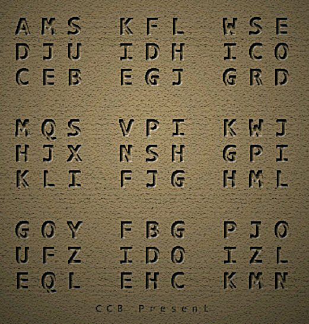

# 第二幕（上）・房间 5

## 题面

“呃……比起其它题来说，这题显得太简陋了吧……”
“越简单的构造意味着难度越大啊……”

## 答案

_官方存档未提供答案。_

## 解析

_官方存档未填写解析。_

## 本地附件

- [b3b636d1349333519a50271c.jpg](../../../assets/imgsrc.baidu.com/forum/pic/item/b3b636d1349333519a50271c.jpg)

来源：[https://tieba.baidu.com/p/1173852788?see_lz=1](https://tieba.baidu.com/p/1173852788?see_lz=1)
