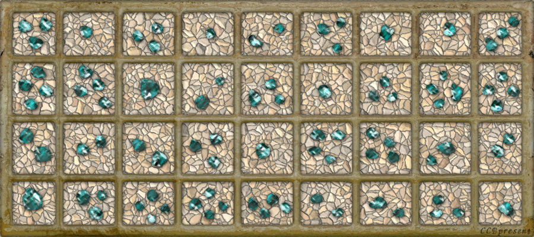

# 第二幕（上）・房间 6

## 题面

“喔麦嘎！好多的蓝宝石！”蔡巍近乎用扑的冲到前面，凑近了细细地看。
“外面的框看起来像是纯金的……”我也抑制不住内心的激动。
“我的天啊，这难道是蓝钻石么……”蔡巍咽了下口水，“这一块可就上百万……美元啊……”
“呵呵，感觉好像来到了小说中的金银屋啊……”
“开玩笑，金银屋？这可是钻石屋啊……”

## 答案

_官方存档未提供答案。_

## 解析

_官方存档未填写解析。_

## 本地附件

- [9a4fd21b634991bcac6e751c.jpg](../../../assets/imgsrc.baidu.com/forum/pic/item/9a4fd21b634991bcac6e751c.jpg)

来源：[https://tieba.baidu.com/p/1173852788?see_lz=1](https://tieba.baidu.com/p/1173852788?see_lz=1)
