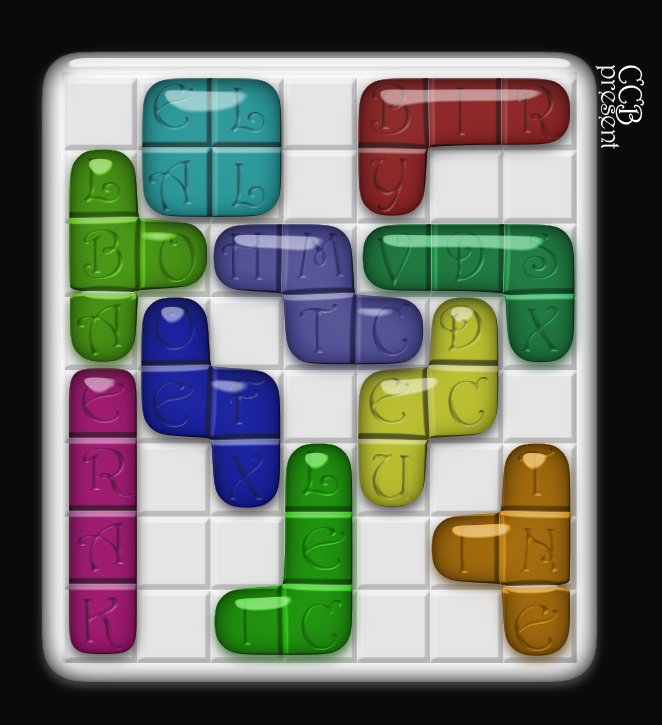

# 第二幕（上）・房间 7

## 题面

“连玻璃都出现了，而且是彩色玻璃啊……”蔡巍显然对谜题的技术水平产生了更大的兴趣。
“确实是难以置信的技术啊……不过题目显然没有技术那么高明，应该是这个没错……”

## 答案

_官方存档未提供答案。_

## 解析

_官方存档未填写解析。_

## 本地附件

- [5e504a9068bef9e4a877a41d.jpg](../../../assets/imgsrc.baidu.com/forum/pic/item/5e504a9068bef9e4a877a41d.jpg)

来源：[https://tieba.baidu.com/p/1173852788?see_lz=1](https://tieba.baidu.com/p/1173852788?see_lz=1)
